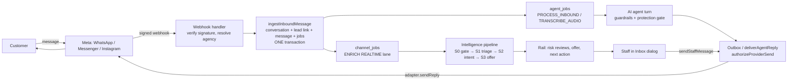
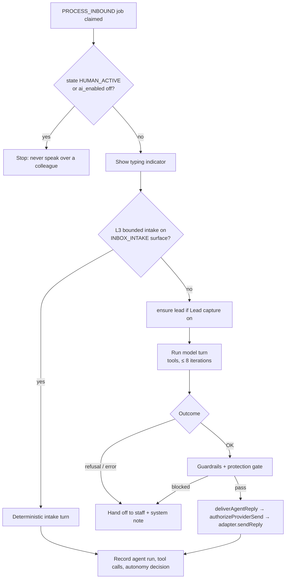

# Inbox, Channels and AI Agent — Complete Functional Guide

> **What this is.** A deep, code-verified explanation of how the Inbox dialog works, how its three channels
> (WhatsApp, Messenger, Instagram) behave, what the AI agent and Manasik Copilot do, every task staff can
> perform, realistic scenarios, and how each part touches the rest of the CRM.
>
> **Who it is for.** Staff (how to work), administrators (how to configure), and engineers/QA (why it behaves
> as it does, and where to look).
>
> **Basis.** Written from the source on branch `fixing-inbox` (2026-09-24). Where behaviour depends on a
> setting, plan or feature flag, that is stated. Section 13 lists behaviours that surprised us while reading
> the code — read it before relying on a setting. Companion documents:
> [`usage.md`](./usage.md) (short staff guide), [`architecture.md`](./architecture.md) (design record),
> [`scaling.md`](./scaling.md), [`checklist.md`](./checklist.md).

---

## Contents

1. [The big picture](#1-the-big-picture)
2. [The Inbox dialog](#2-the-inbox-dialog)
3. [The three channels](#3-the-three-channels)
4. [The AI layers](#4-the-ai-layers)
5. [Task catalogue — everything you can do, and how](#5-task-catalogue--everything-you-can-do-and-how)
6. [Use cases and scenarios](#6-use-cases-and-scenarios)
7. [Impact on other sections of the CRM](#7-impact-on-other-sections-of-the-crm)
8. [Roles and permissions](#8-roles-and-permissions)
9. [Administrator configuration map](#9-administrator-configuration-map)
10. [Background jobs and timings](#10-background-jobs-and-timings)
11. [Data retention and privacy](#11-data-retention-and-privacy)
12. [Troubleshooting and FAQ](#12-troubleshooting-and-faq)
13. [Behaviours to know about (verified in code)](#13-behaviours-to-know-about-verified-in-code)
14. [Glossary and source map](#14-glossary-and-source-map)

---

## 1. The big picture

### 1.1 One sentence

Every customer message — from WhatsApp, Messenger or Instagram — is stored as a **canonical conversation
message** in one shared, agency-scoped Inbox. Staff reply from that Inbox; an optional AI agent may answer
first; a separate intelligence layer (Manasik Copilot) reads each conversation, flags risk and proposes next
steps. Delivery rules, risk rules and permissions are **deterministic code**, so they keep working when the AI
is off, slow or wrong.

### 1.2 The end-to-end flow



Three rules explain most of the design:

1. **The webhook never calls a model.** It verifies the signature, stores the message and its jobs in one
   database transaction, answers Meta `200`, and only then (via `after()`) kicks a worker. Meta retries
   aggressively; a slow model call would cause duplicates.
2. **The last gate before Meta is always deterministic.** `authorizeProviderSend` re-checks channel window,
   ownership, open reviews, autonomy level and stale prices immediately before every provider call. Hiding a
   button in the UI is never the security boundary.
3. **The AI writes; code decides whether it may be sent.** A model answer must clear guardrails (length,
   unbacked numbers, never-autonomous phrases, open blocking reviews) or it is dropped and a human is asked.

### 1.3 Vocabulary you will see

| Term | Meaning |
|---|---|
| **Conversation** | One customer on one channel (`conversations` row). The same person on two channels = two conversations, optionally linked to one lead. |
| **Canonical message** | A message stored in one shape regardless of provider, with `role` (`user`/`assistant`/`staff`/`system`), `actor_kind` (`CUSTOMER`/`AI`/`STAFF`/`SYSTEM`) and delivery status. |
| **Conversation state** | `AI_ACTIVE`, `AI_RESUMED`, `HUMAN_REQUESTED`, `HUMAN_ACTIVE`, `CLOSED` — who owns the reply. |
| **Service window** | How long after the customer's last message a free-text reply is allowed (24 h on all three channels). |
| **Lead** | The CRM sales record the conversation is bound to (`conversations.lead_id`). The bridge to Leads, Quotes, Bookings. |
| **Intervention / review** | A "human review required" card raised by a risk detector. `BLOCK` severity stops automated sending. |
| **Surface** | A named AI capability with its own on/off, mode and autonomy level (`INBOX_REPLY`, `INBOX_INTAKE`, `INBOX_TRIAGE`, `WHATSAPP`). |
| **Autonomy level** | L0 Observe · L1 Draft for staff · L2 Approved safe replies · L3 Bounded intake. |
| **Lane** | A priority class of background work: `REALTIME` (intelligence), `BULK` (media). |

---

## 2. The Inbox dialog

### 2.1 Opening it

The Inbox is a **dialog**, not a page. Three ways in:

- the **Inbox icon in the application header** (`components/header-inbox-launcher.tsx`);
- a **notification** (for example an @mention or a handoff alert) — opens straight onto that conversation;
- a **dashboard "Inbox intelligence" number** — opens the Inbox already filtered to the queue behind that
  number (`openInboxView`). Each figure is a shortcut to its records, not an unexplained model total.

The dialog content is lazy-loaded; a skeleton shows first.

### 2.2 Layout: four regions

```
┌────────────┬──────────────────┬──────────────────────────────┬────────────────────┐
│ View rail  │ Conversation     │ Conversation panel           │ Context panel      │
│ (queues,   │ list             │ header · thread · composer   │ + Intelligence rail│
│ New chat)  │ search, paging   │ policy banner · templates    │ lead, booking,     │
│ collapsible│                  │                              │ offer, reviews     │
└────────────┴──────────────────┴──────────────────────────────┴────────────────────┘
```

The dialog loads in **independent pieces**, so a slow one never blocks the others:

| Piece | Loaded by | Contains |
|---|---|---|
| 1. List | `loadInboxListAction` | conversations for the open view (up to 100 + cursor), counts, capabilities, templates |
| 2. Conversation | `loadInboxConversationAction` | messages, attachments, media analyses, notes, saved replies, brochure links, mentionable staff, your saved draft, composer presence |
| 3. Lead context | `loadInboxLeadContextAction` | lead, booking, permissions, identity proposals, existing handoff |
| 4. Intelligence | `loadInboxIntelligenceAction` | Copilot's stored reading (digest, intent, offer, risks) |

Each has its own retry button on failure. After the first load the dialog updates by **scoped reads** —
list patches, thread deltas, notes deltas, presence — not full reloads (see 2.9).

### 2.3 View rail and queues

The rail lists **views**. Every view *is* a queue; membership is computed once in SQL
(`compute_conversation_queues`) and read from `conversation_queue_membership`. The count badge on the open
view is counted from the loaded list (`12`, or `100+` when more pages exist), never from a stored counter.

Agencies with `agency_settings.inbox_queues_v2` see the **grouped rail**; others see the original nine views
(All, Unassigned, Assigned to me, WhatsApp, Instagram, Messenger, Email, Closed, Spam).

| Group | Queue | What puts a conversation here |
|---|---|---|
| **Inbox** | All conversations | Every open conversation |
| | Assigned to me | Open conversations that are yours |
| | Unassigned | Open, nobody owns it |
| | Needs a reply | Customer wrote last |
| | Waiting for customer | We replied last |
| | Waiting for our team | A colleague was asked, or a review is open |
| | Closed | Closed conversations |
| | Spam | Lead marked spam |
| **Sales** | New enquiries | First-time customers asking about a trip |
| | Qualified | Travellers, dates and room type known |
| | Ready to book | Customer agreed; needs a booking |
| | Quote sent | A quote is with the customer |
| **Needs attention** | Urgent | Blocking review open, or customer in urgent need |
| | Complaints | Unhappy customer / refund ask |
| | Payments | Payment talk, or a claim needing checking |
| | Documents | Passports/photos/documents involved |
| | Visa questions | Customer asking about a visa |
| | Nearing deadline | About to miss a reply target or messaging window |
| | Overdue | Reply target already missed |
| **Channels** | WhatsApp · Instagram · Messenger · Email | Open conversations on that channel |

*Departure changes* and *Group changes* exist in the catalogue but are hidden until their SQL predicate is
built (`available: false`), so the rail never shows a permanently-empty row.

**Commercial queues** read `commercial_stage`, derived from records only:
`LOST → BOOKED → BOOKING_READY → QUOTE_SENT → READY_TO_RECOMMEND → QUALIFYING → UNQUALIFIED` (first match
wins). A customer asking a question after a quote does **not** drop back to "new".

### 2.4 Conversation list

- **Search** box ("Search conversations"); **Load older chats** pages further back.
- Each row shows contact (avatar colour is stable per contact; Arabic names use the Arabic font), a snippet of
  the latest message, the channel, and a state badge:

| State | List badge | Header badge | Meaning |
|---|---|---|---|
| `AI_ACTIVE` / `AI_RESUMED` | AI replying | "Manasik Copilot is replying" | The assistant owns the chat |
| `HUMAN_REQUESTED` | Needs staff (red) | Waiting for staff | AI handed off, or nobody could answer; a person must pick it up |
| `HUMAN_ACTIVE` | Staff replying | You are replying | A person owns it; AI is silent |
| `CLOSED` | Closed | Closed | Finished (see 2.8 for reopening) |

### 2.5 The thread

- **Bubble styling by author:** customer left, staff/assistant right (primary colour), system notes centred and
  dashed, internal notes centred with an author and time, tool rows hidden.
- **Delivery status** on outbound messages: *Sending…* → *Sent* → *Delivered* → *Read* (blue) or *Failed*.
- **Attachments** show an inline preview with an intelligence card ("Attachment review") for voice notes,
  passports and receipts (section 4.7).
- **Optimistic sending:** your message appears immediately as *Sending…* while the server confirms in the
  background. If it fails you see *Not sent* with **Retry** and **Dismiss**. Retry re-uses the **same
  idempotency key**, so a lost response can never produce a duplicate message.
- **Reply-window clock:** re-evaluated every minute, so a window that closes while you are looking flips the
  composer without a refresh.

### 2.6 The composer

Two tabs: **Reply** and **Note**. If replying is blocked (closed window, no permission) the box opens on
**Note**, the one thing that still works.

| Control | Shows when | What it does |
|---|---|---|
| **Reply** tab | always | Message to the customer |
| **Note** tab | always | Internal only, never sent. Has a **Mention staff** picker → notifies the colleague |
| **Suggest reply** (sparkles) | Reply tab and you may use Copilot | Asks Copilot for a grounded draft, placed in the box **as editable text** |
| **Saved replies** | Reply tab, saved replies exist | Appends the saved body |
| **Attach brochure** | Reply tab, brochure links exist | Appends `Title: URL` |
| **Create quote** | Reply tab | Creates a *draft* quote from the matched offer; nothing is sent |
| **Send** / **Add note** | — | `Enter` sends, `Shift+Enter` newline |

Behaviours worth knowing:

- **Auto-saved draft.** Typing is saved to the server ~0.7 s after you stop, so a draft follows you between
  devices; sending clears it.
- **Presence (soft lease).** Focusing the Reply box "claims" the composer; a heartbeat renews it every 60 s and
  it goes stale after ~2 minutes. A colleague opening the same chat sees *"X is writing a reply"*. It is a
  **warning, not a lock** — a closed tab must never strand a customer. It also raises the
  `CONCURRENT_COMPOSER` signal.
- **Sending takes control automatically.** If the chat is `AI_ACTIVE`, `AI_RESUMED` or `HUMAN_REQUESTED`, your
  first send calls `takeControl` first, so the AI stops — exactly like typing in the WhatsApp Business app.

### 2.7 The channel-policy banner

Above the composer, the banner states what is allowed *right now* on this conversation:

| Channel state | Banner action | Composer |
|---|---|---|
| WhatsApp, window open | "Service window open — a free-form reply is allowed" | Enabled |
| WhatsApp, window closed | "Choose an approved template; its charge is shown before sending" + **Choose approved template** | Disabled |
| Messenger/Instagram, window open | "The 24-hour reply window is open" | Enabled |
| Messenger/Instagram, window closed, human, open support case, ≤ 7 days | "A human-written support reply is allowed under the HUMAN_AGENT tag" | Enabled |
| Messenger/Instagram, otherwise | "…seven-day support window is closed. Re-engage elsewhere with consent or wait for the customer" | Disabled |
| Messenger/Instagram, customer never wrote | "…only lets you reply after the customer has messaged you" | Disabled |
| Conversation closed | "This conversation is closed." | Disabled |
| No permission | "You don't have permission to reply here." | Disabled |

The banner is advisory. The server repeats every check at send time (2.10).

### 2.8 The ⋯ conversation menu

Only actions valid for the current state *and* your role are listed:

| Action | Available when | Result |
|---|---|---|
| **Take control** | state is `AI_*` or `HUMAN_REQUESTED`, you have `takeControl` | `HUMAN_ACTIVE`, assigned to you; AI stops |
| **Hand back to AI** | `HUMAN_ACTIVE`, you have `releaseToAi` | `AI_RESUMED`; AI answers the next customer message |
| **Close conversation** | not already closed, you have `closeConversation` | `CLOSED` |

**A closed conversation is not final.** The customer's next message reopens it (`CLOSED` is deliberately not
sticky — otherwise later messages would be stored but invisible). `HUMAN_ACTIVE` and `HUMAN_REQUESTED` are
never overridden by an inbound message; the AI must never speak over a colleague.

### 2.9 Realtime, without a storm

Realtime is an **invalidation signal, not a data source**. A broadcast says *which* thing changed and how new
it is — never the content (payloads are strict; a message body or phone number would fail to parse). The
browser then performs **one bounded scoped read**: a list patch, a thread delta after the last sequence
number, a notes delta, or a presence read. Your own send, note or composer claim never waits for realtime —
it reads back only what it changed. An event the browser cannot parse triggers one bounded reconciliation.
Version numbers make out-of-order patches harmless (an older list patch is ignored).

### 2.10 What the server checks on every staff send

`sendStaffMessage` runs, in order:

1. `requireUser()`, Zod validation of the body and idempotency key.
2. Role has `sendMessage`; conversation is in **your agency**.
3. **Protection gate** (`STAFF_SEND`): if a *blocking* review is open and your text says what the review
   guards (e.g. "we have received your payment" while a payment claim is open), it is refused until Finance
   resolves the review with a note. If open reviews cannot be read, nothing is sent — *unknown is not clear*.
4. Conversation not `CLOSED`; the channel has an adapter installed.
5. **Window check** — WhatsApp: only an approved template after 24 h. Messenger/Instagram: only the
   HUMAN_AGENT path (human, support-case kind ∈ {COMPLAINT, DISTRESSED_CUSTOMER, FRAUD_CONCERN,
   MEDICAL_URGENCY, REFUND_REQUEST}, inside the human window). Otherwise refused with a plain-language error.
6. `takeControl` if you did not already own the chat.
7. `enqueue_inbox_text_message` RPC (idempotent on your key) → creates the message + an outbox row.
8. If the send used a Copilot proposal, its evidence row is updated (accepted / edited / rejected — see 4.16).
9. `after()` kicks the **outbox drain**, which **re-authorizes** (`authorizeProviderSend`) and only then calls
   the provider.

The outbox drain retries with back-off (2ⁿ minutes, capped at 30). After `max_attempts` — or on a permanent
error — the row is dead-lettered and the message shows **Failed** with the reason.

---

## 3. The three channels

### 3.1 What is shared

All three channels are implemented behind one interface (`ChannelRuntimeAdapter`) selected in one place
(`lib/channels/registry.ts`). Webhooks, the AI drain, the staff outbox and CRM workflows ask for an adapter by
provider and never import a provider SDK. A provider with no adapter is refused with a clear error — never
treated as WhatsApp, never pretending to send.

Shared pipeline, identical on every channel (`lib/inbox/ingest.ts`):

1. **Upsert the conversation** (unique on agency + channel + customer id). Sets the 24 h service window.
2. **Link the lead** (`linkConversationToLead`) — provider identity first, then exactly one phone match; two
   or more phone matches are left for staff. May create a lead on inbound capture.
3. **Store the message + its jobs atomically** (`ingest_inbound_message_atomic`): the message, the agent job
   and the intelligence `ENRICH` job commit together or not at all. A provider retry of a committed message
   comes back as `duplicate`. A failure throws, so the webhook answers retryably rather than acknowledging a
   message with no work queued.
4. **Persist media** (best effort; the message is visible even if media scheduling fails).
5. If the assistant is **not allowed** on this connection and the chat was AI-owned, mark it
   `HUMAN_REQUESTED` so it shows as waiting for a person.

### 3.2 Side-by-side comparison

| | **WhatsApp** | **Messenger** | **Instagram** |
|---|---|---|---|
| Customer identity | Phone number (`wa_id`) | Page-scoped id (PSID) | Instagram-scoped id |
| Has a phone number? | Yes | **No** — asked once, later | **No** — asked once, later |
| Business can start a chat? | **Yes** — approved template | **No** — customer writes first | **No** — customer writes first |
| Reply window | 24 h | 24 h | 24 h |
| After the window | Approved template only | HUMAN_AGENT tag, ≤ 7 days, human + open support case | Same as Messenger |
| Max text | 4096 chars | 2000 chars (unconfirmed) | **1000 UTF-8 bytes** |
| AI reply cap (guardrail) | 1200 chars | 1200 chars | 1200 chars, auto-split for bytes |
| Automation disclosure | Not required | **Required** | **Required** |
| Quick-reply buttons | Yes | Yes | Yes |
| Inbound audio | Yes | Yes | Yes |
| Typing indicator | Yes | Yes | Yes |
| Staff typing in the native app | "Coexistence" echo | Page-inbox echo | Instagram-inbox echo |
| Billing rows | Per-message charge tracking | — | — |
| Webhook route | `/api/webhooks/whatsapp` | `/api/webhooks/messenger` | `/api/webhooks/instagram` |
| Connect route | Embedded Signup `/api/oauth/whatsapp` | `/api/oauth/messenger` | `/api/oauth/instagram-login` (or Page: `/api/oauth/instagram`) |
| Own AI on/off switch | Agency-wide agent switch | Per-connection **and** agency | Per-connection **and** agency |

Messenger and Instagram share **one webhook implementation**
(`lib/channels/messenger/webhook-handler.ts`), told which channel it serves. Their AI switches default to
**off** until an administrator turns them on.

### 3.3 WhatsApp in depth

**Connecting.** *Management → Settings → Integrations → WhatsApp → Connect with Meta.* Meta Embedded Signup
runs as a full-page redirect (not the JS popup). If the Meta account has several numbers you pick one
("Connect this number"); a Meta **test number** is labelled as unable to receive real customers. **Test
Connection** verifies the token; the first *signed* inbound event proves end-to-end delivery
(`WEBHOOK_VERIFIED`). Statuses: Not Connected, Connected, Degraded/Error, Restricted, Unfunded, Disconnected.

**Inbound handling (`lib/whatsapp/webhook-handler.ts`).**
- Signature verified over the **raw body** before any parsing. Bad signature → recorded as a size stub only
  (never the attacker-written body), `401`.
- Tenant gate: the payload's `phone_number_id` resolves to exactly one agency, or the event is recorded and
  dropped — an agency is never guessed.
- Byte-identical redeliveries collapse to one audit row; message-level idempotency does the real work.
- Supported: text, images, documents, audio/voice, button taps (a tap arrives as ordinary text carrying the
  button title). **Video, stickers and unsupported file types are not stored**; the customer gets one polite
  "please send something we can open" notice per sender per delivery.
- **Click-to-chat campaign attribution** is resolved from a tracking code/QR in the opening message, before the
  conversation row is written, so first-touch capture lands (feeds Campaigns/Leads).
- **Status webhooks** update ticks (sent/delivered/read/failed) and record Meta's pricing category/billability
  per message; a nightly job prices them.
- **Account-state webhooks** (`account_update`, template status, quality) update the connection: revoked or
  disabled → `ERROR`, violation/restriction → `RESTRICTED`, payment-method problems → `UNFUNDED`. A successful
  later send clears `UNFUNDED`.
- **Coexistence echoes:** a message typed in the WhatsApp Business app appears in the CRM thread as staff
  ("WhatsApp Business app") and flips the chat to `HUMAN_ACTIVE` so the assistant stays quiet.

**Starting a chat (New chat).** The **New chat** button (rail; needs `sendMessage`) opens *Start a WhatsApp
chat*: full international number (8–15 digits, country code required), optional contact name, an **approved
template**, and its variables. Sending creates/opens the conversation as `HUMAN_ACTIVE`, assigned to you,
links an **existing** lead if the number matches (it does **not** auto-create a lead — creating one is an
explicit action), and stores the rendered template text as a `TEMPLATE` message.

**Resuming after 24 h.** In a closed-window conversation the banner offers **Choose approved template**: pick
a category, fill every variable, check the preview and the *projected Meta charge* (latest observed unit rate
for that recipient country/category; "no observation yet" is shown honestly), then **Send approved template**.
Free text is refused server-side.

**Templates** are managed in *Management → Settings → WhatsApp templates* (synced from Meta) and edited in
*Settings → Communications*. Billing visibility is in *Settings → WhatsApp billing*.

**Health.** A nightly job (`whatsapp-health`, 03:00) and the send path both reflect token/funding problems on
the connection card and in the Inbox; a known-bad connection is **not retried against Meta** — the job
completes without sending and a human sees the state.

### 3.4 Messenger in depth

**Connecting.** *Integrations → Messenger → Connect with Facebook*, then choose the Page ("Which Facebook Page
should this CRM use?"). Needs `META_APP_ID` and `META_MESSENGER_CONFIG_ID` on the deployment; if missing the
button explains instead of failing.

**Assistant switch.** "Let the assistant reply on Messenger" — **off by default**. When on, the assistant
tells customers it is an automated assistant and a person can take over. Persona, tone and knowledge are the
*same on every channel* (there is no per-channel persona by design).

**Inbound.** One webhook per channel serves every agency's Page; the tenant is the Page id in the payload.
Handled events: `message`, `echo`, `delivery`, `read`.

**Echoes (the subtle part).** Meta fires an echo for *any* message the Page sent — including our own API
sends, and the echo can arrive before our row is saved. Acting on it naively would flip the chat to
`HUMAN_ACTIVE` and silence the assistant on its own reply. So:
1. an echo from our own app id is ignored;
2. an echo whose message id is already stored (including split-reply part ids) is ignored;
3. anything else is **deferred 10 s** (`RECONCILE_ECHO` job); if still unknown it is recorded as a person
   ("Messenger Page inbox") and the chat goes to staff.

**Profile names.** New customers show a placeholder until a background lookup fetches their name.

**Voice, video.** Voice is transcribed only if the agency enabled voice, a transcription key exists, the
assistant will actually answer, and the payload carried a URL; otherwise the assistant asks the customer to
type. Video is refused with the same polite notice.

### 3.5 Instagram in depth

Same handler and rules as Messenger, with these differences:

- **Two connection methods.** Preferred: **Instagram Login** (*Connect with Instagram*) — sign in with
  Instagram, **no Facebook Page needed**; scopes `instagram_business_basic` and
  `instagram_business_manage_messages` (least privilege), `force_reauth` so a shared computer never reuses a
  remembered account. Fallback: **Connect through a Facebook Page instead**. Both write a
  `channel_connections` row with `provider = INSTAGRAM`; the Login one is marked
  `connect_method = INSTAGRAM_LOGIN`, uses `graph.instagram.com` and its own token.
- **1000-byte limit counts bytes, not characters.** Sinhala, Tamil and Arabic take 2–3 bytes per character,
  so a reasonable 400-character reply can overflow. Replies are **split** at paragraph → line → sentence
  (including "।", "؟", "۔") → word boundaries — never mid-emoji or mid-conjunct — instead of being blocked.
  Each part fires its own echo, so *all* part ids are stored (`part_mids`) to keep every echo recognisable as
  ours.
- Verification token and app secret may be Instagram-specific (`INSTAGRAM_VERIFY_TOKEN`,
  `INSTAGRAM_APP_SECRET`); the main app's secret is always accepted.
- Echo label: "Instagram inbox".

### 3.6 Decision table: "Can I send free text right now?"

| Channel | Window open | Window closed, ≤ 7 days | > 7 days / never wrote |
|---|---|---|---|
| WhatsApp | ✅ Free text | ⚠️ Approved template only | ⚠️ Approved template only |
| Messenger | ✅ Free text | ⚠️ Human reply on an **open support case** only (`HUMAN_AGENT`) | ❌ Wait for the customer (or re-engage elsewhere with consent) |
| Instagram | ✅ Free text | ⚠️ Same as Messenger | ❌ Same |

**Automation can never use `HUMAN_AGENT`.** Only a human-authored, active-support reply with an open support
case may carry the tag, and the tag is applied only in the outbox drain.

### 3.7 Connection health and send failures

The adapter classifies every failure into `TOKEN_DEAD`, `OUTSIDE_SERVICE_WINDOW`, `NOT_REGISTERED`,
`RATE_LIMITED`, `UNFUNDED`, `UNKNOWN`.

| Class | What happens |
|---|---|
| `TOKEN_DEAD`, `UNFUNDED` | Reflected on the connection immediately; **never retried blindly**; a human sees the state |
| `RATE_LIMITED` | The only class worth a bounded retry |
| others | Logged / dead-lettered with a plain-language explanation on the message |

---

## 4. The AI layers

There are **two different AI systems** in the Inbox. Confusing them is the most common source of
misunderstanding.

| | **A. The AI agent** (auto-reply) | **B. Manasik Copilot for the Inbox** (intelligence) |
|---|---|---|
| Purpose | Talks to the customer | Reads conversations, flags risk, drafts for staff, proposes actions |
| Trigger | Inbound message → `PROCESS_INBOUND` job | Inbound message → `ENRICH` job; staff pressing **Suggest reply** |
| Speaks to customer? | Yes, if allowed | **Never** on its own — drafts are for staff, except L2/L3 bounded cases |
| Configured in | *Management → AI agent* + per-channel switch | *Management → AI agent → Inbox autonomy* and surfaces |
| Code | `lib/agent/whatsapp/*` (used by all 3 channels) | `lib/inbox/intelligence/*`, `lib/inbox/risk/*`, `lib/inbox/autonomy/*` |

The name **Manasik Copilot** is used for both in the UI. The customer sees the agent under the display name
the agency configures (default "Assistant").

### 4.1 The AI agent turn, step by step



Details:

- **Re-checked before running.** State can change between enqueue and claim (a colleague took over); the drain
  checks again.
- **Typing indicator** is shown while the model works (best effort).
- **Bounded intake runs first.** If the INBOX_INTAKE surface is effectively L3, the deterministic intake
  handles the message and the free-form model is skipped (see 4.9).
- **Max 8 tool iterations** per turn; the last 20 messages are the history window.
- **Telemetry:** every run records model, effort, tokens (input/output/cache), latency, stop reason, status
  and each tool call (results redacted).
- **Quick-reply buttons are deterministic**, not model-decided: *Book Now* appears only after
  `get_departure_details` succeeded for a booking-enabled agency; *Confirm booking* / *Change details* only
  after `review_booking`. WhatsApp titles stay ≤ 20 characters.

### 4.2 Which model answers

When a free model has been opted into (`AI_FREE_CHAT_MODEL`; by default none is), a conversation still purely between
customer and assistant (`AI_ACTIVE`, no staff message in history) runs first on that **free, fast model** with no
thinking step (7 s budget). Without it, every turn uses the paid model. If it fails or returns nothing, it is
retried on the **paid model** — but only when every tool it already ran was read-only, so a retry can never
duplicate a lead, note or booking. Anything a person has touched (staff wrote, customer asked for a person,
`AI_RESUMED`) goes straight to the paid model with adaptive thinking. The free model is off unless
`AI_FREE_CHAT_MODEL` names one (`off` or empty disables it).

### 4.3 What the agent can do (tools)

Which tools exist depends on the checkboxes in *Management → AI agent → Capabilities*.

| Tool | Requires | What it does | Writes data? |
|---|---|---|---|
| `get_upcoming_departures` | always | Open departure groups, soonest first (party size defaults to 1) | No |
| `search_departures` | always | Filter by package template etc. | No |
| `get_departure_details` | always | One departure's details | No |
| `check_departure_availability` | always | Live seat check | No |
| `find_or_create_lead` | Lead capture | Finds or creates the lead for this contact; no duplicate per phone | Lead |
| `update_lead` | Lead capture | Name, city, party, preferences once the customer typed them | Lead |
| `add_lead_note` | Lead capture | Internal note for the human who takes over | Lead note |
| `capture_contact_number` | Lead capture | Records a phone number a Messenger/Instagram customer gave | Lead |
| `search_knowledge_base` | Knowledge base on **and** ≥ 1 ready document | Policy/guide lookup (cancellation, payment rules, visa/health guidance, FAQs). Never for prices/dates/seats | No |
| `transfer_to_staff` | Handoff | Sets `HUMAN_REQUESTED`, assigns an owner, writes a system note with the reason | Conversation |
| `start_booking` | Booking (needs Lead capture) | Begins a booking session for a group and party size, only after clear intent | Booking session |
| `record_traveller` | Booking | Records each traveller | Booking session |
| `review_booking` | Booking | Builds the live summary; must be read back verbatim | — |
| `confirm_and_hold_booking` | Booking | Creates a **seat HOLD** after the customer's explicit yes (their exact words are stored) | Booking (HOLD) |
| `get_booking_status` | Booking | Reads the current step | No |

**What the agent may never do:** confirm a booking, record a payment, cancel anything, or quote a price it did
not get from a tool this turn. A hold is released by the hourly `release-seat-holds` sweep; a staff member
confirms and takes payment.

**Booking is a state machine, not a conversation.** The model calls tools; the tool layer enforces the order
(start → travellers → review → confirm) so a model cannot skip a step.

### 4.4 The system prompt

Assembled with stable content first (this ordering is the prompt-cache key):

1. **Frozen preamble** — Manasik Copilot as the channel's assistant for a Hajj & Umrah agency; seven ground
   rules (numbers only from tools; may create/update leads and notes but never confirm bookings, payments,
   cancellations; hand off when in doubt; short replies; use the knowledge base for policy; never record
   names/passport/date/phone from a voice note; call independent tools in one step).
2. **Channel rules** — Messenger/Instagram: *automation disclosure* on the first reply and after > 1 day of
   quiet; *phone-number rule* (ask once, politely, once they show real interest; never guess; **never reveal
   what the number matches**, so nobody can probe who is a customer).
3. Agent name and agency; tone; **behaviour instructions**; persona text; reply languages (English, Sinhala,
   Tamil); timezone and currency; a list of what the agent is currently able to help with.

### 4.5 Conversation style settings (*Management → AI agent*)

| Setting | Options | Effect |
|---|---|---|
| Agent status | on/off | Off = messages still arrive and are stored; Inbox behaves as a plain shared inbox |
| Agent name, persona, tone | Friendly & Professional / Formal / Concise | Prompt |
| Languages | English, Sinhala, Tamil | Replies in the customer's language, default English |
| Capabilities | Lead capture, Booking, Handoff, Voice notes | Which tools exist (Voice: transcribes and answers in writing; **recording is not kept**) |
| Reply length | Short / Balanced / Detailed | 1–3 sentences … fuller when asked |
| Emoji | None / Light / Free | |
| Format | Plain / Bullets | Bullets allow WhatsApp bold |
| Package enquiry style | Full details / Short summary / Ask first | *Ask first*: don't list until narrowed. *Show first*: call the departures tool immediately |
| Details to show | dates, duration, prices, room types, seats left, hotels, flights, meals, transport, ziyarah, visa, insurance… | Only what is in the tool result; never invent hotels/flights |
| Questions to ask | travellers, room preference, name, city, travel month, budget | Order matters; skips what the customer already said |
| One question at a time | on/off | |
| Greeting / Closing / Extra rules | free text (≤ 400 chars for greeting/closing) | |
| Handoff style | After enquiry / When asked / Offer always | |
| Seat hold duration (hours) | number | How long an AI hold lasts |
| Max turns per conversation | number (default 40) | See 13 |
| Escalate after failed turns | number (default 3) | See 13 |
| Out-of-hours message | optional text | |

### 4.6 The outbound guardrails

Every agent reply must clear `checkOutboundReply` or it is **dropped**:

| Check | Fails when |
|---|---|
| AI enabled | agency switch is off |
| Don't talk over a colleague | conversation `HUMAN_ACTIVE` or `CLOSED` |
| Service window | the 24 h window has expired |
| Max turns | message count ≥ configured maximum |
| Empty / too long | empty, or > 1200 characters |
| **Unbacked numbers** | reply contains a run of 3+ digits, or "only 3 seats left"-style claim, and **no number-backing tool succeeded this turn**. Only departure/booking tools count — a knowledge-base result stating "LKR 15,000" does **not** unlock quoting it |
| **Protection gate** | says anything on the never-autonomous list, or **any blocking review is open** |
| Fail-closed | open reviews cannot be read |

A blocked, refused or errored turn produces **no message** (silence is safer than a half-formed reply) — but
the customer is still waiting, so the chat is **handed to staff** with a system note in plain words, e.g.
*"The assistant could not reply, so this chat was passed to staff. Its draft reply was held back: reply
contains a number with no tool call to back it this turn."* Notes like "AI disabled", "conversation is
HUMAN_ACTIVE" are not failures and do not hand off.

### 4.7 Handoff to staff

Triggered by the model (`transfer_to_staff` — required when the customer asks for a person or the topic
touches money, refunds, complaints, visa/medical detail, or low confidence), by the deterministic
failed-turn path above, by bounded-intake completion, or by the assistant being off on the connection.

**Who becomes owner** (`resolveHandoffOwner`): if the agency turned on Inbox routing, a four-step chain —
1. **Sticky:** the lead's existing owner, if available (continuity beats balance);
2. **Coordinator by topic:** group enquiry (party ≥ threshold) → Operations; visa → Visa; documents →
   Operations (roles configurable);
3. **Least-loaded** (or round-robin) among available inbox staff — ties break on last-assigned time, then id;
4. **Fallback:** `default_lead_owner_id` if available.
Nobody available → **Unassigned** (visible, clock running). "Available" = active account inside its access
window, on a shift, not on leave, able to send Inbox messages. Without a routing policy the configured default
owner is used, exactly as before routing existed.

### 4.8 Voice notes

1. Webhook stores a placeholder plus the media reference and queues `TRANSCRIBE_AUDIO` (only if voice is on
   and a transcription key exists; otherwise the customer is asked to type).
2. The worker downloads the audio through the channel adapter, transcribes it, saves the transcript on the
   message, then queues the ordinary `PROCESS_INBOUND` (idempotent — a retry never queues two replies).
3. The **agent is told the text is a transcript** and must never record a name, passport/ID, date or phone
   number from it — it asks the customer to type or confirm.
4. In the Inbox, staff can play the retained original and see the transcript labelled **non-authoritative**.

### 4.9 Quiet-lead nudges and handoff alerts (`lead-followups`, every 10 min)

Phase 1 notifies staff about customers **waiting on a person too long**
(`handoff_alert_minutes`, `handoff_escalation_minutes`). Phase 2 **nudges quiet customers** after the
assistant replied, only when the agency enables follow-ups (`followups_enabled`), **dry-run first**
(`followups_dry_run`), with configurable delays and text, optionally via an approved WhatsApp template.
The step is claimed in a ledger **before** sending so a crash cannot double-send; consent and do-not-contact
are checked. See [`../runbooks/lead-followups-operations.md`](../runbooks/lead-followups-operations.md).

### 4.10 The intelligence pipeline (Copilot B)

One `ENRICH` job = one run for one conversation, on the **REALTIME lane**.

| Stage | Name | Model? | Does |
|---|---|---|---|
| **S0** | Gate | No | Decides whether to spend money. Target: 55–70 % of inbound messages exit here. Every skip has exactly one reason (`SKIP_SURFACE_OFF`, `SKIP_ENTITLEMENT_EXHAUSTED`, `SKIP_SPAM`, `SKIP_CLOSED`, `SKIP_HUMAN_ACTIVE`, `SKIP_UNCHANGED_INPUT`, `SKIP_ACKNOWLEDGEMENT`). A bare "ok" after we asked a question is treated as the **answer**, not an acknowledgement |
| — | **Red flags** | No | Refund request, distress language, unapproved bank number are recorded **whatever the gate decided**. *Risk is never gated on cost* (a test pins this and must never be deleted) |
| Digest | Rolling summary | No | Appends each turn to a token-budgeted digest, dropping oldest first — a 300-message chat costs the same to triage as a 3-message one. Sinhala/Tamil are budgeted pessimistically |
| **S1** | Triage | One call, rule fallback | Intent (`PACKAGE_ENQUIRY`, `PRICE_REQUEST`, `BOOKING_REQUEST`, `PAYMENT_CLAIM`, `DOCUMENT_ISSUE`, `VISA_QUERY`, `ITINERARY_QUERY`, `COMPLAINT`, `CANCELLATION`, `GROUP_ENQUIRY`, `FAQ`, `SPAM`, `OTHER`), urgency, sentiment |
| **S2** | Travel intent | Rules first; model only for what rules missed | Journey, travellers, window, room, hotel distance, budget, origin — each stored with the customer's own words and source (`RULES`/`LLM`). A model field must **quote the customer, the quote must occur in their messages**, and values are checked against closed lists — otherwise dropped |
| **S3** | Offer match | **No model** | Best live departure + runners-up via the same matcher the Leads drawer uses, so the two can never disagree. Runs only once journey and party size are known |
| — | Commercial stage & value | No | Derived from records; **value comes only from the matched offer** — a model never sets a price |

The handler is idempotent (same fingerprint ⇒ no write). Bursts coalesce: five messages in eight seconds
produce **one** run (settle delay; first contact is not delayed). A repair sweep restores any lost `ENRICH`
job, so a customer message never sits without a reading.

An agency with **no `INBOX_TRIAGE` surface row is OFF**, not permissive (it costs money).

### 4.11 What the context rail shows

The rail never says more than the evidence supports (Architecture §5.8):

- With no reading yet: what is known for certain (channel, lead stage, language) plus *"Copilot is reading
  this conversation"*. Never an empty panel.
- A keyword reading is **labelled** as one — nothing rule-derived pretends to be AI.
- Every model-derived fact carries the message it came from (evidence popover); low confidence is said aloud.
- **Offer card:** *Best departure*, *Includes*, *Be aware*, *Not known yet*, *Other options*, with four
  buttons: **Draft reply**, **Create quote**, **Open group**, **Ask follow-up**. *Draft reply* and *Create
  quote* are disabled unless the live re-check says the offer can be quoted (fresh price and seats); drafts
  land in the composer as editable text. Brochure links come from the composer dropdown, and holding seats
  from the Convert menu.
- **Triage review control:** "Review this triage reading" — staff record the correct intent; this builds the
  agency-specific accuracy sample used for promotion (R5).
- A surface that is off and has no stored reading hides the rail entirely.

### 4.12 Risk detectors and human-review cards

Eleven **rule-only** detectors (no model) raise "Human review required" cards. `BLOCK` severity stops
automated sending; some also stop specific *staff* sentences.

| Detector | Fires when | Guards |
|---|---|---|
| `PAYMENT_CLAIM_UNVERIFIED` | Customer says (past tense) they paid and no confirmed payment covers it; if an amount is named the confirmed total must reach it. Questions/promises ("I will pay") don't count | Blocks "we've received your payment" |
| `BANK_DETAIL_MISMATCH` | A bank account not on the approved list is mentioned | Blocks sending unapproved bank details |
| `STALE_PRICE_QUOTED` | A price was sent, and the offer's `priced_at` has since moved (change-detection, **never a timer**) | — |
| `GROUP_FULL_REQUESTED` | Requested group has fewer seats than the party, or is no longer for sale | Blocks confirming unavailable inventory |
| `PASSPORT_EXPIRY_RISK` | Passport expires before departure + the agency's validity months. No expiry on file ≠ risk | — |
| `WINDOW_CLOSING_SOON` | Free-reply window closes within 2 h and we still owe an answer | — |
| `CONCURRENT_COMPOSER` | Someone is writing a reply (touched < 2 min ago) | — |
| `LOW_CONFIDENCE_DRAFT` | Intent confidence below the rail's threshold | — |
| `SENSITIVE_DOC_RECEIVED` | File name/caption names a passport, ID, birth certificate, bank statement | — |
| `MINOR_OR_ASSISTANCE_NEEDED` | Traveller < 18 at departure, an accessibility need, or words like "wheelchair" | — |
| `UNRECORDED_BOOKING_CLAIM` | Customer quotes a booking reference we have no booking for | — |

Plus model/rule signals that open reviews of kind `REFUND_REQUEST`, `DISTRESSED_CUSTOMER`, `COMPLAINT`,
`FRAUD_CONCERN`, `MEDICAL_URGENCY`, `RELIGIOUS_RULING`, and `SLA_BREACH`.

**Review lifecycle:** `OPEN → ACKNOWLEDGED → RESOLVED | DISMISSED`. Resolving or dismissing **requires a
note**. Money reviews (payment claim, bank detail, refund) can be closed only by Finance or Admin; the rest by
anyone who works the Inbox. The card badges: **Do not confirm yet** (blocking), **Someone is on it**
(acknowledged), with a *What to do* line.

### 4.13 The never-autonomous list

Eleven things automation may **never** say, at **any** level — in code, not configuration (a test asserts
each is refused at every level; a deny list an administrator can clear is not a deny list):

Confirm a payment was received · promise a visa will be approved · grant a discount · confirm unavailable
inventory · make a material booking change · send unapproved bank details · commit to a refund or
cancellation · give a religious ruling · give health/safety advice · close a complaint · send a marketing
broadcast.

Three layers enforce it: the **prompt** (weakest), the **phrase matcher** (`findNeverPromise`, errs toward
refusing), and the **outbound send gate** (strongest, no level consulted). A **person** may still say any of
these — a person is held to the *open-review gate* instead.

### 4.14 Autonomy levels

| Level | Name | What may go to the customer without a person | Surface mode |
|---|---|---|---|
| **L0** | Observe only | Nothing is proposed or sent | `SHADOW` / `OFF` |
| **L1** | Draft for staff | Nothing automatic; **Suggest reply** drafts appear for staff | `PROPOSE` |
| **L2** | Approved safe replies | Only **approved templates** and **approved cached answers** | `ACTIVE` |
| **L3** | Bounded intake | Deterministic intake questions + provisional lead + handover | `ACTIVE` |

**Effective level** = the *lowest* of: plan **entitlement ceiling**, surface **mode**, configured **level**,
and conversation ownership (a human-active chat is L0). Evidence, plan and ownership can only ever *lower* it.

**Promotion** to L2/L3 is locked until measured evidence shows: ≥ 7 days observed, ≥ 200 reviewed decisions,
triage accuracy ≥ 85 %, payment-claim precision ≥ 95 %, **zero** never-autonomous violations, and staff
rejection rate below the configured threshold. The UI lists the current blockers.

**Automatic demotion:** at L2/L3, if the same evidence stops holding, the level drops one step (L3→L2,
L2→L1) via `set_inbox_autonomy_level`, audited with the reasons.

**First 14 days after promotion** are *narrow*: only out-of-hours acknowledgements, approved qualifying
questions and approved FAQ answers may be sent.

**Every level change is audited.** Every automated send or refusal is written to `inbox_autonomy_decisions`.

### 4.15 Bounded intake (L3)

A four-question form, not a conversation. It runs **before** the free-form model and is a state machine:

`DATES → DEPARTURE_CITY → ROOM_ARRANGEMENT → PASSPORT_READINESS → HUMAN_REVIEW`

- Questions are canned in **English, Sinhala and Tamil** (language detected by script).
- The first message is *not* filed as the answer to "what dates": a plain greeting still gets the dates
  question; a message naming a month/period counts.
- **Deny topics hand over immediately** at any step, in any language (incl. Singlish/Tanglish): price,
  discount or booking; payment confirmation; refund/cancellation; visa promises; medical/health; religious
  rulings.
- Two blank/stalled turns → hand over.
- On completion it creates/updates a **provisional lead** (period, city, room preference), adds a lead note
  ("Manasik Copilot"), assigns an owner through routing, sets `HUMAN_REQUESTED` and writes a system note. It
  can **never** hold inventory, confirm a booking, or write money. Its allowed tools are read-only departures,
  lead find/update/note, phone capture, knowledge search and handoff.
- A duplicate first webhook cannot send two replies: the first turn is claimed atomically by inserting the
  intake-state row (the primary key rejects the second).

### 4.16 Suggest reply and proposal evidence

**Suggest reply** (L1+): checks role and Copilot permission, autonomy ≥ L1, **consent** (do-not-contact /
opted-out refuses), the protection gate, then builds a bounded, **redacted** reply pack (recent turns, stored
digest, verified CRM facts, matched offer, approved knowledge) and returns a draft. A `PROPOSED` decision row
is written *before* you see it. It never contains a balance or other forbidden fields (redaction backstop).

When you send, the proposal is scored by edit similarity: **accepted** (sent as drafted), **edited**, or
**rejected** (substantially rewritten). This evidence feeds promotion. A rejected proposal that came from an
approved cached answer counts toward retiring that answer.

### 4.17 Approved-answer cache

Stable FAQ answers can be reused without a model call, under strict rules:

- Only intents `FAQ`, `ITINERARY_QUERY`, `DOCUMENT_ISSUE` are cacheable.
- **Never cacheable:** price/availability, visa outcome/eligibility, payment/refund, medical advice,
  religious rulings, named travellers.
- A candidate appears after the **3rd consistent** occurrence; a person must **approve** it in *Management →
  AI agent → Knowledge → Approved answers*.
- Served only if **approved**, same agency, **current knowledge version**, similarity ≥ **0.88**, and not
  expired (**90 days**). Knowledge/package/pricing changes bump the version and invalidate older answers.
- **Two substantial staff corrections retire** the answer with a recorded reason.

### 4.18 Plans, allowances and graceful degradation

AI conversations are metered **once per conversation per billing period**. As usage grows the *expensive*
stages degrade first; deterministic safety never does:

| Utilisation | Mode |
|---|---|
| < 80 % | Full |
| ≥ 80 % | On-demand drafts only |
| ≥ 100 % (no overage opt-in) | Rules and matching only |
| ≥ 120 % | Deterministic only |

Human replies remain available at any usage; rule-based risk detection never stops. A plan downgrade can only
**clamp** autonomy downward and records why. Existing agencies started **grandfathered**.

---

## 5. Task catalogue — everything you can do, and how

Legend: 🔑 = permission needed · 🤖 = AI involved · ⚠️ = irreversible / outward-facing.

### 5.1 Reading and organising

| Task | How | 🔑 | Notes |
|---|---|---|---|
| Find a conversation | Type in **Search conversations** | view | |
| Work a queue | Click a queue in the rail (e.g. *Needs a reply*, *Overdue*) | view | Badge shows loaded count |
| See only my chats | **Assigned to me** | view | |
| Jump from the dashboard | Click an *Inbox intelligence* number | view | Opens the exact queue |
| Read older chats | **Load older chats** | view | |
| Collapse the rail/panel | Toggle buttons | view | |
| Translate | **Translate** control (summary and text) | 🤖 | Non-authoritative |
| Review triage | *Review this triage reading* → pick intent → **Record** | Copilot | Trains promotion evidence |

### 5.2 Replying

| Task | How | 🔑 | Notes |
|---|---|---|---|
| Reply | Reply tab → type → `Enter` | `sendMessage` | ⚠️ Takes control if not yours |
| Draft with Copilot | **Suggest reply**, edit, send | Copilot + L1+ | 🤖 Always editable |
| Use a saved reply | **Saved replies** dropdown | `sendMessage` | |
| Send a brochure link | **Attach brochure** | `sendMessage` | Link text only |
| Send a template (WhatsApp, closed window) | Banner → **Choose approved template** → variables → **Send approved template** | `sendMessage` | ⚠️ Shows projected charge |
| Retry a failed send | **Retry** under *Not sent* | `sendMessage` | Same key ⇒ never duplicated |
| Leave a note / mention a colleague | Note tab; **Mention staff** | `sendMessage` | Never sent to customer; notifies mentioned user |

### 5.3 Ownership and state

| Task | How | 🔑 |
|---|---|---|
| Take control | ⋯ → **Take control** | `takeControl` |
| Hand back to AI | ⋯ → **Hand back to AI** | `releaseToAi` |
| Close | ⋯ → **Close conversation** | `closeConversation` |
| Assign | via routing / take control | `assignConversation` |
| Clear all chats | Rail → **Clear all chats**, type the exact confirmation phrase | ⚠️ **ADMIN only**; deletes every conversation of the agency (leads, bookings and AI run history stay; seat holds are released by the hourly sweep) |
| Retry a failed job | job retry | `retryFailedJob` (ADMIN) |

### 5.4 Starting conversations

| Task | How | Notes |
|---|---|---|
| New WhatsApp chat | **New chat** → number (with country code) → name → template → variables → **Send and open chat** | ⚠️ Costs money per Meta pricing category; links an existing lead only |
| Resume an old WhatsApp chat | Template picker in the banner | |
| Messenger/Instagram | Not possible — customer writes first | Tell the customer to message the Page/account |

### 5.5 Turning a conversation into CRM records

| Task | Button / menu | Creates | Guards |
|---|---|---|---|
| **Link or create lead** | Lead context: *Link or create lead* | Lead (or links existing) | If the contact may already be a lead you must choose *Link conversation* or *Create separate lead* |
| Accept/reject identity match | *Possible existing lead found* card | Links or keeps separate | Only band **HIGH ≥ 0.75** / **MEDIUM ≥ 0.50** are proposed; a name alone is never enough |
| **Select departure group** | *Select departure group* dialog | Records lead intent | Lists only sellable groups with enough seats; **does not hold seats** |
| **Create booking** | *Create booking* | Booking with status `DEPOSIT_PENDING` | Needs lead, group, phone; uses the capacity-safe booking primitive; derives price server-side |
| **Create quote** | Composer / offer card | *Draft* quote | Nothing is sent |
| **Schedule follow-up** | Follow-up control | Lead follow-up | |
| **Create task or case** | Convert menu | One of the 12 conversions below | Two-step: **preview** ("Check before creating") then **confirm** ("Created"); options that can't work stay greyed with the reason |
| **Operations handoff** | *Add customer summary* / *View handoff* | Point-in-time snapshot on the booking | Later edits do **not** rewrite it; Operations acknowledges |

**The convert menu** (all proposals through the approval kernel; each runs under the *owning module's*
capability):

| Conversion | Lands as | Needs |
|---|---|---|
| Request documents | Operations task | Departure group |
| Create visa task | Visa task | Departure group |
| Follow up on payment | Finance task | Departure group |
| Rooming request | Operations task | Departure group |
| Transport requirement | Operations task | Departure group |
| Escalate to guide | Guide task | Departure group |
| Open complaint case | Support case | Traveller profile |
| Create traveller profile | Pilgrim profile | Lead, no profile yet |
| Record family or mahram link | Traveller relationship | Booking, two travellers |
| Hold seats | Seat hold | Lead, group, no booking, phone |
| Recommend a package | Package recommendation | Lead |
| Request post-trip feedback | Feedback survey | Departure group |

Every created object stores the source conversation and message (traceable back). A conversion confirmed
moments ago is not created twice by a double-click.

### 5.6 Media

| Item | What staff see | Rule |
|---|---|---|
| Voice note | Play original + non-authoritative transcript/summary | Uncertain transcription → confirm with customer |
| Passport image/PDF | Candidate fields (number, expiry, name) vs the pilgrim record | Expiry/mismatch/low confidence opens a review. Values are **never** silently applied. Multi-traveller bookings need you to **select the traveller** |
| Payment receipt | Amount/reference/date candidate | Opens a Finance-owned `PAYMENT_CLAIM` review. **Never creates, allocates or confirms a payment** |
| Brochure/other | Original + classification | Classified only when evidence is sufficient |
| Inbox copy expiry | The card shows *"The Inbox copy expires <date>"* | Inbox attachments follow the retention window (default 90 days) |
| **Promote to Documents** | Backend primitive only (`lib/inbox/retention/promote-attachment.ts`) — copies to a traveller's document requirement and exempts the Inbox copy from expiry | **No button calls it yet** — see Section 13 item 10. Today, download the file and upload it in the Documents module |

Accepted: images (jpeg/png/webp/gif), PDFs, Office/text documents (PDF, Word, Excel, PowerPoint, text, CSV),
audio. **Video and archives/executables are never downloaded or stored.** Media analysis runs in the **BULK
lane** and never delays receipt of the original message. Originals are private and served by short-lived
signed links.

### 5.7 Reviews

Open the *Human review required* card → read evidence and *What to do* → **Acknowledge**, then **Resolve** or
**Dismiss** with a note. Money reviews: Finance/Admin only.

---

## 6. Use cases and scenarios

Each scenario lists trigger → what the system does → what staff do → result.

### S1 — New WhatsApp enquiry at 2 a.m. (assistant on)
1. Customer: *"Umrah packages in March?"* → webhook stores it, queues `PROCESS_INBOUND` + `ENRICH`.
2. Agent calls `get_upcoming_departures`, shows matching departures per your style settings,
   asks the next question. Lead created (Lead capture on). Guardrail passes because a departure tool backed the
   numbers.
3. Rail (S1–S3): intent `PACKAGE_ENQUIRY`, matched offer, queue **New enquiries**; SLA clock (business hours)
   starts when the office opens.
4. Morning: staff open **Needs a reply** or **New enquiries**, read the digest, click **Take control** (or just
   reply — that takes control), continue.

### S2 — Customer asks for a discount (assistant on)
The model calls `transfer_to_staff`; the chat becomes `HUMAN_REQUESTED`, owner assigned by routing,
system note with reason. Staff see **Needs staff** (red). Any AI text containing a discount promise would have
been stopped by the never-autonomous list regardless.

### S3 — "I've paid, here's the slip"
Customer sends an image. Media job classifies it as a receipt and extracts amount/reference. The
`PAYMENT_CLAIM_UNVERIFIED` detector fires (no confirmed payment) → **blocking** review, Finance-owned,
queue **Payments**. While open, neither the AI **nor staff** can send "payment received". Finance checks the
bank, records the payment in **Finance**, resolves the review with a note. Now a confirmation may be sent.

### S4 — Passport photo with a short expiry
Media job reads the passport. `PASSPORT_EXPIRY_RISK` compares expiry to departure + the agency's validity
months → review. Staff choose the traveller in the card (multi-traveller booking), compare the fields
(anything under 90 % confidence is outlined and marked *Check this field*), upload the passport into
**Documents** manually (see Section 13 item 10), and use *Request documents* if a renewal is needed.

### S5 — Same person on WhatsApp and Instagram
Instagram customer has no phone. Identity graph proposes the lead from a WhatsApp conversation (same full
name + same travel month ⇒ 0.50 + 0.20 = 0.70, **MEDIUM**). The **Possible existing lead found** card lets
staff **Link conversation** or **Create separate lead**. Nothing merges automatically from weak evidence.

### S6 — Instagram customer, day 3
Window (24 h) expired, they asked about a refund yesterday (a `REFUND_REQUEST` review is open). A **human**
may reply under `HUMAN_AGENT` for up to 7 days *while that support case is open*. The AI cannot. On day 8 the
composer is disabled; staff add a note and wait for the customer.

### S7 — WhatsApp customer returns after a week
Window closed. Banner: *Choose approved template*. Staff pick a re-engagement template, see the projected
charge, send. When the customer answers, a fresh 24 h window opens and free text works again.

### S8 — Colleague replies from the WhatsApp Business phone
Coexistence echo arrives → recorded as staff "WhatsApp Business app", chat → `HUMAN_ACTIVE`, assistant
silent. On Messenger the same happens after a 10 s reconcile, unless the echo is our own send.

### S9 — Voice note in Sinhala
Voice on: transcribed, agent answers in writing, never records names/numbers from it, asks the customer to
type them. Voice off: the customer is told to type.

### S10 — Booking via the AI (Booking capability on)
Customer clearly wants to book → `start_booking` → traveller details → `review_booking` (read back verbatim,
*Confirm booking / Change details* buttons) → the customer says yes → `confirm_and_hold_booking` creates a
**seat hold** with their exact words stored. Staff see the hold, take payment and confirm. If nobody does, the
hourly sweep releases the seats after `seat_hold_hours`.

### S11 — Agency promotes to L3 intake
After ≥ 7 days shadow and ≥ 200 reviewed decisions with zero deny-list violations, admin sets **L3 ·
Bounded intake**. New chats get the four canned questions; on completion a provisional lead + summary note
appears and the chat lands in **Waiting for staff**. In the first 14 days only out-of-hours acknowledgements,
approved qualifying questions and approved FAQ replies may be automated. If quality slips, the level
auto-demotes.

### S12 — Assistant fails mid-conversation
Model down or guardrail blocks the draft. No customer message is sent. Chat → `HUMAN_REQUESTED` with a
system note explaining why. Handoff alerts nudge staff if nobody responds.

### S13 — Two colleagues answer the same customer
A shows "B is writing a reply" (soft lease). If both send, the second send is still allowed (it's a warning,
not a lock). The `CONCURRENT_COMPOSER` signal is raised so it is visible.

### S14 — Flaky network during send
The message shows *Sending…*, then *Not sent*. **Retry** re-uses the key; if the first attempt actually
committed, the server returns the stored message — the customer never gets two.

### S15 — Staff-started outbound campaign
Staff use **New chat** with an approved marketing/utility template. The number is matched to an existing lead
only; a lead is *not* auto-created. The reply from the customer opens a normal conversation.

### S16 — Messenger Page temporarily unfunded/disconnected
Send fails as `TOKEN_DEAD` → connection card shows the problem, retries stop, messages show *Failed* with a
plain reason. Reconnect under Integrations.

---

## 7. Impact on other sections of the CRM

| Section | How the Inbox affects it | How it affects the Inbox |
|---|---|---|
| **Leads** | Creates/links leads from inbound (channel, name, phone, first message); AI updates fields (name, city, party, period, room) and adds notes; *Link or create lead*; stamped `source_conversation_id`; follow-up scheduling | Lead stage, owner, selected group, quotes and booking drive **commercial queues**, sticky routing and the offer card; "Suggest live packages" (Inbox Copilot / lead Copilot) share one matcher |
| **Bookings** | *Create booking* (`DEPOSIT_PENDING`); AI creates seat **holds** only; booking stamped with source conversation | Booking status/balance shown in the context panel (balance only if `canViewBalance`); unrecorded booking references raise a review |
| **Departure groups** | *Select departure group* records intent; *Hold seats* conversion; AI holds reduce available seats until released | Live seats/price drive offer matching, `GROUP_FULL_REQUESTED` and `STALE_PRICE_QUOTED`; departure tasks receive conversions |
| **Quotes** | *Create quote* creates **draft** quotes | Quote status moves the chat to **Quote sent**; quote figures are protected by stale-price detection |
| **Finance / Payments** | Receipts open Finance-owned reviews; *Follow up on payment* task; nothing posts money | Confirmed payments **clear** `PAYMENT_CLAIM_UNVERIFIED`; approved bank accounts define `BANK_DETAIL_MISMATCH`; WhatsApp charges appear in *WhatsApp billing* |
| **Documents / Pilgrims** | *Create traveller profile*; passport traveller selection; (planned) promotion of an attachment into a traveller's document requirement | Passport/expiry data feeds `PASSPORT_EXPIRY_RISK`; document status drives the handoff snapshot |
| **Visa** | *Create visa task*; visa questions land in **Visa questions** queue; routing can send them to the Visa role | Visa outcome talk is never automatable |
| **Operations / Guides** | Handoff snapshot on confirmed bookings; rooming, transport, guide-escalation tasks | Group readiness tasks appear as open items in the handoff |
| **Support incidents** | *Open complaint case* | Open support cases enable the HUMAN_AGENT path |
| **Campaigns / Marketing** | Click-to-chat codes attribute conversations to campaigns; templates are the outbound path | Consent/do-not-contact from Audiences/consent blocks drafts |
| **Dashboard** | *Inbox intelligence* panel: ten queue-backed metrics, pipeline value bucketed **by currency** (never converted), language buckets; every number opens its queue | — |
| **Notifications** | @mentions, handoff alerts, escalations | Clicking one opens the Inbox on that conversation |
| **AI Agent settings / Knowledge** | Approved answers, unanswered-question list feed knowledge improvements | Knowledge/behaviour settings shape every reply |
| **Team / Settings** | Roles gate every action; staff shifts/leave feed routing availability | *Operations → Inbox routing / SLA / staff availability*; retention windows in *Settings → Data* |
| **Billing/Plans** | Usage metered per conversation | Plan ceiling caps autonomy; allowance degrades AI stages |

**Why "source conversation" links matter:** every lead, quote, booking, task and case created from the Inbox
records which conversation (and message) it came from, so a colleague in another module can jump back to the
customer's own words.

---

## 8. Roles and permissions

| Capability | ADMIN | MARKETING | OPERATIONS | CEO | FINANCE | VISA | GUIDE |
|---|:-:|:-:|:-:|:-:|:-:|:-:|:-:|
| View Inbox | ✅ | ✅ | ✅ | ✅ | ✅ | ✅ | ❌ |
| Send messages / notes | ✅ | ✅ | ✅ | ❌ | ❌ | ❌ | ❌ |
| Take control / hand back to AI | ✅ | ✅ | ✅ | ❌ | ❌ | ❌ | ❌ |
| Close conversation | ✅ | ✅ | ✅ | ❌ | ❌ | ❌ | ❌ |
| Assign conversation | ✅ | ✅ | ✅ | ❌ | ❌ | ❌ | ❌ |
| Convert to task/case | ✅ | ✅ | ✅ | ❌ | ❌ | ❌ | ❌ |
| Retry failed job | ✅ | ❌ | ❌ | ❌ | ❌ | ❌ | ❌ |
| **Clear all chats** | ✅ | ❌ | ❌ | ❌ | ❌ | ❌ | ❌ |

Additional gates layered on top: Copilot use (`capabilitiesForLeads.useCopilot`), booking
(`convertToBooking`), group selection (`findGroups`), each conversion's owning-module capability,
`approveInboxAnswer` (defaults ADMIN/CEO, grantable), and money-review closure (Finance/Admin). Every Server
Action starts with `requireUser()`, is agency-scoped, and validates input with Zod.

---

## 9. Administrator configuration map

| What | Where |
|---|---|
| Connect/disconnect/test WhatsApp | *Management → Settings → Integrations → WhatsApp* |
| Connect Messenger / Instagram; **assistant on/off per channel** | *Integrations → Messenger / Instagram* |
| Agent master switch, persona, tone, languages, capabilities, style, holds, limits | *Management → AI agent* |
| **Inbox autonomy level** (L0–L3), blockers, deny list | *Management → AI agent → Inbox autonomy* |
| Knowledge documents, knowledge-base switch, approved answers, unanswered questions | *Management → AI agent → Knowledge* |
| Follow-up nudges, alert timing, dry-run | *Management → AI agent* (follow-up settings) |
| Response-time and cost cards | *Management → AI agent* |
| WhatsApp templates | *Settings → WhatsApp templates* / *Communications* |
| WhatsApp billing | *Settings → WhatsApp billing* |
| **Routing policy** (sticky, group threshold, load balancing, coordinator roles, shifts) | *Settings → Operations → Inbox routing* |
| **SLA targets** per queue and working hours | *Settings → Operations → Inbox SLA* |
| **Staff availability** (shifts/leave) | *Settings → Operations → Staff availability* |
| Signal review | *Settings → Operations → Signal review* |
| **Retention windows** | *Settings → Data* |

### Default SLA targets (minutes on the queue's clock)

| Queue | First reply | Resolution | Clock | Opens a review on breach |
|---|---|---|---|---|
| Urgent (escalations) | 15 | 24 h | Always | ✅ |
| Complaints | 15 | 24 h | Always | ✅ |
| Ready to book | 15 | 4 h | Business hours | ✅ |
| Payments | 30 | 4 h | Business hours | ✅ |
| New enquiries | 30 | 8 h | Business hours | — |
| Needs a reply | 60 | — | Business hours | — |
| Departure/Group changes | 2 h | 24 h | Business hours | — |
| Qualified / Quote sent | 2 h | 48 h | Business hours | — |
| Documents / Visa | 4 h | 24 open h (3×8) | Business hours | — |

Three SLA rules: **(1) the channel window outranks every target** (`due = min(target, window − 2 h)` —
missing a Meta window is unrecoverable); **(2) the clock pauses** while waiting on the customer or resolved,
and resumes from the customer's *next* message; **(3) a breach is a signal, not a storm** — it records
`SLA_BREACHED`, raises priority, and opens a review only on the four queues marked ✅.

### Recommended go-live checklist

1. Connect each channel; confirm status **Connected** and see a real inbound.
2. Sync approved WhatsApp templates (needed to start/resume chats).
3. Configure the AI agent (persona, languages, capabilities) — start with **Lead capture + Handoff**, add
   **Booking** last.
4. Keep `INBOX_REPLY` / `INBOX_INTAKE` at **L0/Shadow** for ≥ 1 week.
5. Publish accurate knowledge, package inclusions, prices and availability.
6. Set routing, SLA targets, staff shifts, retention.
7. Turn the **per-channel assistant switch** on for Messenger/Instagram only when ready.
8. Review evidence before any promotion; promote one step at a time.

---

## 10. Background jobs and timings

| Job | Schedule / trigger | Purpose |
|---|---|---|
| `agent-jobs` drain | every minute, plus `after()` after each webhook | AI agent replies, transcription, echo reconcile, knowledge embedding |
| `inbox-lanes` | every minute | Fair-share drain of `channel_jobs` (REALTIME intelligence, BULK media), shard fan-out when a backlog builds |
| `inbox-sla` | every ~2 minutes | Recompute `sla_due_at`, refresh queue bands, apply breach rules; also repairs lost `ENRICH` jobs |
| `lead-followups` | every 10 minutes | Handoff alerts and quiet-lead nudges |
| `release-seat-holds` | hourly | Release expired AI/staff seat holds |
| `whatsapp-health` | daily 03:00 | Connection health |
| `whatsapp-billing-sync` | daily 04:00 | Price Meta charges |
| `inbox-retention` | daily 02:17 | Delete expired data in bounded batches |
| Echo reconcile | +10 s after an unknown Messenger/Instagram echo | Person vs our own send |
| Composer heartbeat | 60 s; stale after ~2 min | Presence |

All crons authenticate with `Authorization: Bearer $CRON_SECRET` and are exempt from the session redirect.
Lane workers run inside a wall-clock budget (never "until empty"), handlers are idempotent, and a job whose
kind has no registered handler **fails loudly** instead of being silently consumed.

---

## 11. Data retention and privacy

Defaults (bounded identically on every plan — subscription never changes retention):

| Data | Default | Allowed range |
|---|---|---|
| Booking-linked messages | 7 years | 3–10 y |
| Enquiry messages | 24 months | 1–120 mo |
| Inbox attachments | 90 days | 1–365 d |
| Voice audio | 180 days | 1–365 d |
| Intelligence rows | 24 months | 1–120 mo |
| AI run logs | 13 months | 1–60 mo |
| Webhook payloads | 30 days | 1–90 d |

The nightly sweep deletes **Storage objects before database rows** and records cursor, counts and errors; a
dry run counts without mutating. Attachments promoted to **Documents** follow the Documents policy. A Meta
**deauthorisation** revokes the connection; a signed Meta **data-deletion callback** uses the same deletion
path for connection-owned conversations. Webhook bodies from unsigned requests are never stored. Redaction
strips forbidden fields (balances etc.) from anything sent to a model.

---

## 12. Troubleshooting and FAQ

| Symptom | Likely cause | Fix |
|---|---|---|
| Composer greyed out on WhatsApp | 24 h window closed | Use **Choose approved template** |
| Composer greyed out on Messenger/Instagram | Customer never wrote, or window/HUMAN_AGENT period ended | Wait for the customer; add a note |
| "Take control of this conversation before replying" | Send raced with ownership | Refresh; send again (send auto-takes control) |
| "Assigned to another staff member" | Another colleague owns it | Ask them to release, or take control |
| Message stuck *Sending…* → *Failed* | Provider/token problem or dead-lettered | Read the reason on the message; check integration status; **Retry** |
| Send refused: "…while payment claim is open" | Blocking review guards that sentence | Resolve the review with a note (Finance) |
| Send refused: "live offer changed or could not be verified" | Your text quotes a price/seat figure and the stored offer is stale | Refresh the offer, then resend |
| AI never replies | Agent off · channel switch off (Messenger/IG) · state is human · connection not `CONNECTED` · plan/autonomy blocks · no API key | Check each in Section 9 |
| Chat turned to "Needs staff" unexpectedly | Failed turn / guardrail / handoff tool | Read the system note — it states the reason |
| Assistant went silent after a colleague typed in the phone app | Echo recorded as staff (by design) | **Hand back to AI** when done |
| No lead for a Messenger/Instagram customer's booking | No phone yet | Add the number to the lead before *Create booking* |
| "Possible existing lead found" appears | Identity graph found a MEDIUM/HIGH candidate | Link or keep separate |
| Dashboard counts differ from a list | Counts are deterministic queues; a list is one loaded page | Open the queue from the number |
| Rail is missing | Surface `INBOX_TRIAGE` is off and no reading exists | Enable the surface (costs AI usage) |

**Does turning the AI off stop messages arriving?** No. Everything is still stored; the Inbox works as a
plain shared inbox.

**Can staff and AI both talk?** No. Human ownership always wins; the agent checks again just before sending
and the outbox authorizer checks a third time.

**Can the AI quote prices?** Only from a departure/booking tool result in the same turn; otherwise the reply
is blocked.

---

## 13. Behaviours to know about (verified in code)

These are observations from reading the code on 2026-09-24. They are not necessarily bugs, but they change
what a setting actually does. Confirm before promising a behaviour to a customer.

1. **The older WhatsApp assistant switch still authorises ordinary replies.** In
   `authorizeAutomatedInboxSend`, if the `INBOX_REPLY` surface is *not enabled* and a `GENERATED` reply is
   being sent, an agency whose legacy `WHATSAPP` surface is `enabled` + `ACTIVE` is treated as **L3** for that
   reply (protection checks still apply). So **"Keep INBOX_REPLY at L0" does not by itself stop the AI agent
   from answering** — that is governed by the *Agent status* switch and the legacy surface. `usage.md`'s
   "L0 — nothing is sent to the customer" describes the Inbox reply surface, not the classic agent.
2. **`max_turns_per_conversation` can be unreachable.** The guardrail compares the limit to the size of the
   history *window*, which is capped at 20 messages, while the default limit is 40. A limit ≤ 20 works; the
   default never trips.
3. **`escalate_after_failed_turns` is saved but no runtime reads it.** The setting exists in the form and the
   `ai_settings` table, but a failed turn hands off immediately (Section 4.6), not after N failures.
4. **`working_hours` for follow-ups is not implemented** — quiet-lead nudges treat it as "no restriction"
   (noted in `quiet-lead-sweep.ts`).
5. **Messenger's 2000-character limit is "believed, not confirmed"** in the channel profile. The AI cap of 1200
   keeps replies under it regardless; staff messages are not capped by the AI guardrail.
6. **Reopening.** A closed conversation reopens on the next inbound message; a routed owner is not cleared.
7. **`sendStaffMessage` reassigns.** Because a send takes control, replying to a chat owned by a colleague
   reassigns it to you (the outbox authorizer would otherwise refuse "assigned to another staff member").
8. **Departure changes / Group changes queues** are catalogued but hidden until their predicates exist.
10. **"Save to Documents" is not reachable from the Inbox UI.** `usage.md` §5 describes it, and the backend
   primitive exists (`promote-attachment.ts`, "called only after the Documents module has created its
   stricter-access record"), but nothing in `app/` or `components/` invokes it. Until a button is added,
   passport/payment proof must be moved to Documents by hand, and the Inbox copy will expire under the
   attachment retention window.
9. **Programme status.** Per `checklist.md`, many slices are built but unmerged or awaiting live exit
   measurement (Phases 5–6, scaling track). This guide describes the code as it is on the branch; features
   may be behind plan entitlements, `inbox_queues_v2`, or surface settings in a given environment.

---

## 14. Glossary and source map

**Glossary** — *ENRICH*: the intelligence job. *Lane*: priority class of background work. *Outbox*: durable
queue of outbound provider sends. *Echo*: provider notice of a message the business sent. *HUMAN_AGENT*: Meta
tag allowing a human support reply within 7 days. *PSID*: Page-scoped id. *Protection gate*: pure decision
on whether text may go out now. *Proposal*: a Copilot draft or a kernel-approved conversion. *Surface*: a
named AI capability with its own mode/autonomy.

**Source map** (for engineers):

| Area | Files |
|---|---|
| Dialog UI | `app/inbox/components/*`, `app/inbox/actions.ts`, `dialog-actions.ts`, `conversion-actions.ts`, `components/header-inbox-launcher.tsx` |
| Composer/window rules | `lib/inbox/composer-state.ts`, `lib/channels/policy-state.ts`, `lib/channels/profile.ts` |
| Queues & views | `lib/inbox/queues.ts`, `lib/inbox/views.ts`, SQL `compute_conversation_queues` |
| Ingest | `lib/inbox/ingest.ts`, `lib/inbox/lead-linking.ts`, `lib/data/whatsapp-repository.ts` |
| WhatsApp | `lib/whatsapp/*`, `app/api/webhooks/whatsapp`, `app/api/oauth/whatsapp`, `lib/channels/whatsapp-adapter.ts` |
| Messenger / Instagram | `lib/channels/messenger/*`, `lib/channels/instagram/*`, `lib/channels/page-channel-adapter.ts`, `app/api/webhooks/{messenger,instagram}`, `app/api/oauth/{messenger,instagram,instagram-login}` |
| Outbound | `lib/inbox/outbox/drain.ts`, `lib/inbox/outbound/authorize-provider-send.ts`, `lib/agent/whatsapp/reply-delivery.ts`, `lib/channels/text-split.ts` |
| AI agent | `lib/agent/whatsapp/{runtime,drain,guardrails,prompt,preamble,behaviour-prompt,model-routing,voice}.ts`, `tools/*` |
| Intelligence | `lib/inbox/intelligence/*`, `lib/ai/surfaces/inbox/*` |
| Risk | `lib/inbox/risk/*` |
| Autonomy | `lib/inbox/autonomy/*`, `lib/billing/entitlements.ts` |
| Routing / SLA | `lib/inbox/routing/*`, `lib/inbox/sla/*` |
| Conversions / identity / handoff | `lib/inbox/conversions/*`, `lib/inbox/identity/*`, `lib/inbox/handoff/*` |
| Media | `lib/inbox/media/*` |
| Answer cache | `lib/inbox/answers/*` |
| Retention | `lib/inbox/retention/*` |
| Realtime | `lib/inbox/realtime/*` |
| Settings UI | `app/(main)/management/ai-agent/*`, `app/(main)/management/settings/{integrations,operations,communications,whatsapp-templates,whatsapp-billing,data}` |
| Runbooks | `docs/runbooks/{inbox-intelligence-operations,inbox-retention-and-deletion,messenger-meta-setup-and-test,instagram-meta-setup-and-test,messenger-instagram-hardening,lead-followups-operations,channel-messaging-policy-verification}.md` |
