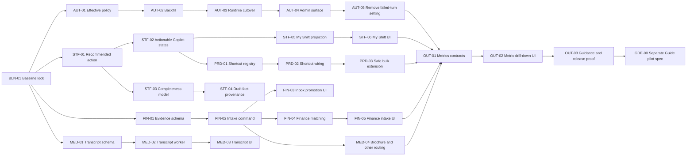

# Manasik Inbox Spec Implementation Plan

**Source specification:** [`spec-plan.md`](spec-plan.md)

**Planning status:** Approved; Phase 0 / BLN-01 complete

**Programme status source:** [`checklist.md`](checklist.md)

**Detailed work items:** [`spec-task-list.md`](spec-task-list.md)
**Last updated:** 2026-09-29

## 1. Purpose

This plan turns the approved planning direction in `spec-plan.md` into small, dependency-ordered delivery slices. It does not replace the existing Inbox architecture, implementation plan, or checklist. Those documents remain authoritative for settled decisions and delivered status.

Planning this work does **not** tick `checklist.md`. A checklist item is updated only in the same PR that proves its exit criterion.

## 2. Delivery rules

- Preserve the deterministic core: queues, permissions, financial truth, document truth, eligibility, and send gates remain deterministic. AI classifies, extracts, ranks, drafts, and explains at the edges.
- Deliver one task as one PR. Do not add adjacent cleanup unless it is required by that task's acceptance criteria.
- Keep each task to five implementation files or fewer. Split a task if discovery expands it beyond that boundary.
- Start every Server Action or Route Handler with `requireUser()`, validate input with Zod, and scope every query and mutation to `agency_id`.
- Add RLS in the same migration as every new table. Storage access must be private and tenant-scoped.
- Do not treat a receipt as a payment, an AI transcript as authoritative customer text, or an AI extraction as verified CRM truth.
- Run focused tests during development, then `npm run lint`, `npm run typecheck`, and `npm run test` before each PR.
- Update `docs/inbox/checklist.md` in the delivery PR, never in advance.

## 3. Decision gates

The following defaults were accepted by the Phase 0 decision lock on 2026-09-29.

| Gate | Locked decision | Blocks |
| --- | --- | --- |
| D1 Finance promotion permission | ADMIN, CEO, FINANCE, and assigned conversation staff with `openFinanceReview`; server-side capability check is authoritative | FIN-02 onward |
| D2 Unmatched Finance evidence retention | Use the agency Inbox retention policy; legal hold overrides deletion | FIN-01 |
| D3 Transcription provider | Use the existing AI provider abstraction; English, Arabic, and mixed-language output allowed; low confidence is visibly labelled | MED-02 |
| D4 Completeness evidence | Track `confirmed`, `customer-stated`, `inferred`, and `missing`; only confirmed/customer-stated values satisfy readiness | STF-03 |
| D5 My Shift default | Open `My Shift` for staff roles; retain the current default for ADMIN/CEO until usage data supports changing it | STF-05 |
| D6 Tag bulk action | Defer until an agency tag taxonomy and permission contract exist | PRD-03 |
| D7 Guide window | Separate pilot specification; no Guide implementation in the core release | GDE-00 |

If a proposed default is rejected, update `spec-plan.md` first when it changes scope or a settled architecture decision.

The repository, migration, rollout, channel, media, and autonomy evidence behind
this lock is recorded in
[`2026-09-29-inbox-bln-01-baseline.md`](../progress/2026-09-29-inbox-bln-01-baseline.md).

## 4. Dependency graph

Autonomy, staff workflow, and Finance schema work may run in parallel after `BLN-01`. Tasks within each lane remain sequential.

## 5. Phases and checkpoints

### Phase 0 - Lock the verified baseline

Deliver `BLN-01`. Reconcile flags, migrations, runtime behaviour, and live channel evidence. This avoids rebuilding features that already exist and establishes the exact before-state for later metrics.

**Checkpoint P0:** baseline matrix is signed off; no implementation begins against an unverified assumption.

### Phase 1 - Remove policy ambiguity

Deliver `AUT-01` through `AUT-05`. Establish one effective autonomy resolver, backfill every agency, switch all runtimes to it, expose the hierarchy in Admin, and remove the misleading failed-turn setting.

**Checkpoint P1:** direct and outbox send paths return the same L0-L3 result; every decision is auditable; no legacy agency fallback remains.

### Phase 2 - Make intelligence actionable

Deliver `STF-01` through `STF-06`. Expose one next action, make loading/error/empty states recoverable, expand readiness to eight facts with provenance, and introduce a My Shift landing projection whose counts drill into exact rows.

**Checkpoint P2:** staff can enter Inbox, understand the next safe action, see why a draft was produced, and open the exact work behind every count.

### Phase 3 - Route financial evidence safely

Deliver `FIN-01` through `FIN-05`. Create an evidence intake separate from the payments ledger, make promotion idempotent, and provide Finance a matching workflow with a link back to the source conversation.

**Checkpoint P3:** copying a receipt never creates, verifies, or changes a payment; cross-tenant and unauthorised access tests deny by construction.

### Phase 4 - Complete media handling

Deliver `MED-01` through `MED-04`. Add staff-only, non-authoritative voice transcripts and useful routing for brochure/other media while preserving playback and download fallbacks.

**Checkpoint P4:** every supported media family has a clear safe action, attribution, retention behaviour, and failure fallback.

### Phase 5 - Accelerate safe work

Deliver `PRD-01` through `PRD-03`. Centralise shortcut definitions, add discoverable keyboard controls, and extend bulk actions only where the same permission and safety invariant applies to every selected row.

**Checkpoint P5:** keyboard and bulk workflows are accessible, collision-tested, and cannot trigger sends, payment mutations, document verification, or review resolution in bulk.

### Phase 6 - Measure and operationalise

Deliver `OUT-01` through `OUT-03`. Add operational, commercial, safety, and AI quality/cost contracts; provide exact drill-down; split guidance by role; and collect release evidence.

**Checkpoint P6 / assisted-operation release:** one week of reconciled metrics, reviewed risk samples, stable channel delivery, and zero `never-autonomous` violations.

### Phase 7 - Decide Guide support separately

Deliver only `GDE-00` in this plan. It produces a separate, approval-gated specification for group-bound Guide access. No Guide code ships as an extension of the staff Inbox by accident.

## 6. Release gates

| Release | Required tasks | Evidence |
| --- | --- | --- |
| Staff-operated pilot | BLN-01, AUT-01..05, STF-01..06, FIN-01..05 | Channel smoke tests, RLS denial tests, payment/passport invariants, exact queue reconciliation, no open P0 security defect |
| Measured assisted operation | MED-01..04, PRD-01..03, OUT-01..03 | One week of metrics, reviewed AI/risk samples, transcript fallback proof, accessibility and shortcut checks |
| Bounded autonomy pilot | Existing promotion gates plus completed autonomy lane | Explicit agency opt-in, entitlement ceiling, quiet-hours/consent/window gates, kill switch, rollback drill |
| Guide pilot | GDE-00 plus a separately approved implementation plan | Assigned-group isolation, post-departure window, cross-group denial, audited replies |

## 7. Verification strategy

### Per task

1. Write or update the focused Vitest test first for every business-rule branch.
2. Run the task's focused tests listed in `spec-task-list.md`.
3. Run lint and typecheck for all implementation tasks.
4. Run the full test suite before opening the PR.
5. For UI tasks, execute the existing Inbox browser acceptance and record screenshots or trace evidence in the PR.
6. For migration/RLS tasks, verify authenticated allowed paths plus cross-agency and unauthorised denial paths.

### Cross-capability scenarios

- A receipt can be promoted twice without duplicate Finance evidence and without changing `payments`.
- A passport continues to promote only through the existing Documents workflow.
- A voice note always remains playable when transcription is pending, fails, or is disabled.
- A proposed reply shows the exact verified facts used and never upgrades inferred data to confirmed data.
- My Shift and metric cards reconcile exactly with their filtered Inbox rows.
- L0-L3 decisions are identical in direct-send, queued/outbox, replay, and retry paths.
- Keyboard commands do nothing in text-entry contexts unless explicitly scoped there.
- Bulk operations fail closed when the selection contains an unauthorised conversation.

## 8. Risk register

| Risk | Mitigation | Proof |
| --- | --- | --- |
| Two autonomy authorities remain after migration | One exported effective-policy resolver; legacy reads forbidden by contract test | Direct/outbox parity and legacy-authority tests |
| Evidence intake becomes a shadow ledger | Separate table and permissions; no FK-trigger or action may write payment truth | No-payment-mutation integration test |
| AI text is mistaken for verified truth | Store provenance/confidence; label transcript and inferred facts; require explicit confirmation | Unit and browser assertions |
| Dashboard counts drift from queues | Derive count and drill-down from one projection/filter contract | Count-to-row reconciliation tests |
| Shortcut conflicts harm accessibility | Central registry, focus guards, help overlay, browser keyboard acceptance | Collision and focus-context tests |
| New media jobs increase cost or latency | Entitlement checks, size/duration limits, async processing, cost metrics | Worker, quota, and failure-path tests |
| Guide access leaks data across groups | Separate spec and data boundary; no reuse of broad staff Inbox query | Cross-group RLS denial suite |

## 9. Scope control

This plan does not include a full omnichannel rebuild, AI-authored financial decisions, automatic payment creation, authoritative transcription, a universal attach-to-any-record control, bulk sending, unrestricted bulk tagging, or Guide access to the staff Inbox. New requests in those areas require a specification change before implementation.

## 10. Ordered task index

| Order | Task | Capability | Depends on | Size |
| ---: | --- | --- | --- | --- |
| 1 | BLN-01 Baseline and decision lock — complete 2026-09-29 | inbox-core | - | S |
| 2 | AUT-01 Effective autonomy policy — implemented on `refining-inbox`, awaiting merge | autonomy-unification | BLN-01 | M |
| 3 | AUT-02 Agency backfill and audit | autonomy-unification | AUT-01 | M |
| 4 | AUT-03 Runtime cutover | autonomy-unification | AUT-02 | M |
| 5 | AUT-04 Admin hierarchy surface | autonomy-unification | AUT-03 | M |
| 6 | AUT-05 Failed-turn setting removal | autonomy-unification | AUT-04 | S |
| 7 | STF-01 Recommended next action — implemented in managed worktree `inbox-stf-01`, awaiting merge | staff-action-surface | BLN-01 | M |
| 8 | STF-02 Actionable Copilot states | staff-action-surface | STF-01 | S |
| 9 | STF-03 Eight-fact completeness | staff-action-surface | STF-01, D4 | M |
| 10 | STF-04 Draft fact provenance | staff-action-surface | STF-03 | M |
| 11 | STF-05 My Shift projection | staff-action-surface | STF-02, D5 | M |
| 12 | STF-06 My Shift UI | staff-action-surface | STF-05 | M |
| 13 | FIN-01 Finance evidence schema — merged in PR #167 | finance-evidence | BLN-01, D2 | M |
| 14 | FIN-02 Idempotent intake command — merged in PR #168 | finance-evidence | FIN-01, D1 | M |
| 15 | FIN-03 Inbox promotion UI — implemented and verified on `codex/inbox-fin-03`, awaiting browser acceptance and merge | finance-evidence | FIN-02 | S |
| 16 | FIN-04 Finance matching service — implemented and verified on `codex/inbox-fin-04`, awaiting merge | finance-evidence | FIN-02 | M |
| 17 | FIN-05 Finance intake UI — implemented and verified on `codex/inbox-fin-05`, awaiting browser acceptance and merge | finance-evidence | FIN-04 | M |
| 18 | MED-01 Transcript persistence — migration and contract tests on `codex/inbox-med-01`, awaiting live RLS proof and merge | media-routing | BLN-01 | M |
| 19 | MED-02 Transcript worker — implemented and verified on `codex/inbox-med-02`, awaiting a staging run and merge | media-routing | MED-01, D3 | M |
| 20 | MED-03 Transcript UI and fallback — implemented and verified on `codex/inbox-med-03`, awaiting browser verification and merge | media-routing | MED-02 | S |
| 21 | MED-04 Brochure and other routing — implemented and verified on `codex/inbox-med-04`, awaiting browser verification and merge | media-routing | FIN-02 | M |
| 22 | PRD-01 Shortcut registry — implemented and verified on `codex/inbox-prd-01`, awaiting merge (STF-02 dependency unbuilt, recorded in the checklist) | productivity-controls | STF-02 | S |
| 23 | PRD-02 Shortcut wiring and help — implemented and verified on `codex/inbox-prd-02`, awaiting browser keyboard acceptance and merge | productivity-controls | PRD-01 | M |
| 24 | PRD-03 Safe bulk extension — implemented and verified on `codex/inbox-prd-03`; its migration is written but not applied | productivity-controls | PRD-02, D6 | M |
| 25 | OUT-01 Outcome metric contracts — implemented and verified on `codex/inbox-out-01`; AUT-05/STF-06 dependencies unbuilt, dependent metrics declared blocked | outcomes-and-guidance | AUT-05, STF-06, FIN-05, MED-04, PRD-03 | M |
| 26 | OUT-02 Metric drill-down UI — implemented and unit-verified on `codex/inbox-out-02`; browser drill-down not yet run | outcomes-and-guidance | OUT-01 | M |
| 27 | OUT-03 Role guidance and release proof — guides written on `codex/inbox-out-03`; release evidence not collected | outcomes-and-guidance | OUT-02 | M |
| 28 | GDE-00 Guide pilot specification | guide-group-support | OUT-03, D7 | S |

## 11. Approval gate

Before implementation starts, reviewers should confirm:

- [x] Decision gates D1-D7 are accepted or explicitly deferred.
- [x] Task ordering and parallel lanes are acceptable.
- [x] Finance evidence remains separate from payment truth.
- [x] Voice transcripts remain staff-only and non-authoritative.
- [x] Guide support remains a separate pilot specification.
- [x] BLN-01 is the first authorised task and is complete; no later task starts without its dependencies.

